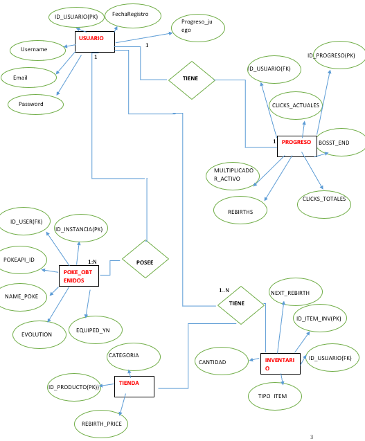

#  Poke-Clicker

**Autores:** Jesus Daniel Renteria Calzada, Heriberto Yurem Vasquez Cervantes
**Asignatura:** Implementa aplicaciones móviles multiplataforma


### Jesus Daniel Renteria Calzada


**Número de control:** 23308060610259  
**Correo electrónico:** 23308060610259@cetis61.edu.mx

### Heriberto Yurem Vasquez Cervantes


**Número de control:** 23308060610438  
**Correo electrónico:** 23308060610438@cetis61.edu.mx

**Especialidad:** Programación

**Poke-Clicker** es un proyecto de videojuego tipo **"Idle Clicker"** donde la progresión del jugador se basa en la acumulación de clics y la gestión estratégica de recursos inspirados en el universo Pokémon.

---

##  Descripción del Proyecto

El objetivo principal es acumular clics para avanzar en el juego. La experiencia comienza desde cero: al realizar el primer clic, el sistema interactúa con la **PokéAPI** para otorgar al usuario un Pokémon inicial de forma totalmente aleatoria.

### Mecánicas Principales

* **Sistema de Rebirth (Renacimiento):** Al alcanzar una cantidad considerable de clics, el jugador tiene la opción de "renacer". Esta acción resetea el contador de clics actuales, pero otorga un **Boost de velocidad** (incremento de clics por segundo) durante unos minutos, permitiendo una recuperación acelerada del nivel.
* **Tienda:** Un espacio dedicado para intercambiar puntos de renacimiento por artículos de utilidad:
    * **Caramelos:** Objetos para subir de nivel a los Pokémon y activar sus evoluciones.
    * **Mejoras de Boost:** Adquisición de potenciadores de clics adicionales.
    * **Pokémon Aleatorios:** Posibilidad de probar suerte para obtener nuevas criaturas.
* **Inventario:** Repositorio personal donde se almacenan permanentemente todas las compras, ganancias y Pokémon obtenidos.

---

## 📊 Estructura de la Base de Datos

El diseño lógico de la base de datos está optimizado para gestionar de manera eficiente la información de los usuarios, su progreso dinámico y la integración con datos externos de la PokéAPI.

### Diagrama Entidad-Relación (MER)



*El diagrama anterior detalla las relaciones entre las entidades de Usuario, Progreso, Tienda, Inventario y Pokémon obtenidos.*

---

##  Implementación Técnica (SQL)

A continuación, se presenta el script necesario para generar la estructura de tablas y las restricciones de integridad (llaves foráneas) que aseguran la consistencia de los datos.

```sql
CREATE TABLE usuarios (
    id_usuario INT AUTO_INCREMENT PRIMARY KEY,
    username VARCHAR(50) NOT NULL,
    email VARCHAR(100) NOT NULL UNIQUE,
    password VARCHAR(255) NOT NULL,
    fecha_registro TIMESTAMP DEFAULT CURRENT_TIMESTAMP
);

CREATE TABLE progreso_juego (
    id_progreso INT AUTO_INCREMENT PRIMARY KEY,
    id_usuario INT NOT NULL,
    clicks_actuales BIGINT DEFAULT 0,
    clicks_totales BIGINT DEFAULT 0,
    cantidad_rebirths INT DEFAULT 0,
    costo_siguiente_rebirth BIGINT DEFAULT 100,
    multiplicador_activo FLOAT DEFAULT 1.0,
    fin_boost DATETIME NULL,
    FOREIGN KEY (id_usuario) REFERENCES usuarios(id_usuario) ON DELETE CASCADE
);

CREATE TABLE tienda (
    id_producto INT AUTO_INCREMENT PRIMARY KEY,
    nombre_producto VARCHAR(100) NOT NULL,
    descripcion TEXT,
    categoria ENUM('item', 'pokemon', 'boost') NOT NULL,
    costo_rebirths INT NOT NULL,
    valor_efecto FLOAT NOT NULL
);

CREATE TABLE pokemones_obtenidos (
    id_instancia INT AUTO_INCREMENT PRIMARY KEY,
    id_usuario INT NOT NULL,
    pokemon_api_id INT NOT NULL,
    nombre_personalizado VARCHAR(50),
    nivel INT DEFAULT 1,
    esta_equipado BOOLEAN DEFAULT FALSE,
    FOREIGN KEY (id_usuario) REFERENCES usuarios(id_usuario) ON DELETE CASCADE
);

CREATE TABLE inventario_items (
    id_item_inv INT AUTO_INCREMENT PRIMARY KEY,
    id_usuario INT NOT NULL,
    id_producto INT NOT NULL,
    cantidad INT DEFAULT 1,
    FOREIGN KEY (id_usuario) REFERENCES usuarios(id_usuario) ON DELETE CASCADE,
    FOREIGN KEY (id_producto) REFERENCES tienda(id_producto) ON DELETE CASCADE
);


---

<<<<<<< HEAD
=======
#📊 Especificación de la Base de Datos: poke_clicker_db
1. Entidad: usuarios
Módulo encargado de gestionar la persistencia para las funciones de autenticación (Login, Registro, Recuperación) y las operaciones CRUD de los perfiles de usuario.

id_usuario: Tipo de dato Entero (INT). Atributo obligatorio con propiedad de auto-incremento. Actúa como la Clave Primaria (PRIMARY KEY) de la entidad.

num_control: Tipo de dato Cadena de caracteres (VARCHAR) con longitud máxima de 20. Atributo obligatorio con restricción de unicidad (UNIQUE) para evitar registros duplicados.

nombre_usuario: Tipo de dato Cadena de caracteres (VARCHAR) con longitud máxima de 50. Atributo obligatorio.

correo: Tipo de dato Cadena de caracteres (VARCHAR) con longitud máxima de 100. Atributo obligatorio con restricción de unicidad (UNIQUE) para mitigar la duplicidad de cuentas.

password: Tipo de dato Cadena de caracteres (VARCHAR) con longitud máxima de 255. Atributo obligatorio destinado al almacenamiento seguro de las credenciales de acceso.

pokedolares: Tipo de dato Entero (INT). Define el saldo financiero del usuario con un valor predeterminado por defecto de cero.

clics_totales: Tipo de dato Entero (INT). Registra la métrica acumulada de interacciones del usuario, inicializado por defecto en cero.

fecha_registro: Tipo de dato de marca temporal (TIMESTAMP). Registra de forma automatizada la fecha y hora exacta del alta del usuario mediante el valor del sistema (CURRENT_TIMESTAMP).

2. Entidad: mejoras
Catálogo maestro que define los atributos, costos y factores de beneficio asociados a los objetos disponibles en la tienda del sistema.

id_mejora: Tipo de dato Entero (INT). Atributo obligatorio con propiedad de auto-incremento. Actúa como la Clave Primaria (PRIMARY KEY) de la entidad.

nombre: Tipo de dato Cadena de caracteres (VARCHAR) con longitud máxima de 50. Atributo obligatorio.

costo_base: Tipo de dato Entero (INT). Atributo obligatorio que especifica el costo financiero inicial requerido para la adquisición del objeto.

multiplicador: Tipo de dato Decimal (DECIMAL 5,2), con una precisión total de 5 dígitos y 2 posiciones decimales. Atributo obligatorio que determina el impacto matemático en los algoritmos del juego.

tipo: Tipo de dato de enumeración cerrada (ENUM). Restringe los valores estrictamente a las opciones fijas: 'activo' o 'pasivo'. Atributo obligatorio.

3. Entidad Relacional: usuario_mejoras
Tabla asociativa que rompe la relación de muchos a muchos entre las entidades de usuarios y mejoras, encargada de la persistencia del progreso e inventario individual de cada jugador.

id_usuario: Tipo de dato Entero (INT). Atributo obligatorio que hereda la identidad del jugador.

id_mejora: Tipo de dato Entero (INT). Atributo obligatorio que mapea el objeto adquirido.

nivel_actual: Tipo de dato Entero (INT). Registra el nivel de la mejora con un valor predeterminado por defecto de uno.

Restricciones de Integridad Referencial:
Clave Primaria Compuesta: La combinación única de los campos id_usuario e id_mejora constituye la clave primaria de esta tabla, previniendo duplicidades de un mismo objeto por usuario.

Clave Foránea fk_usuario_autenticado: El atributo id_usuario se vincula con el campo homólogo de la tabla usuarios. Implementa políticas de integridad referencial ON DELETE CASCADE y ON UPDATE CASCADE.

Clave Foránea fk_mejora_adquirida: El atributo id_mejora se vincula con el campo homólogo de la tabla mejoras. Implementa políticas de integridad referencial ON DELETE CASCADE y ON UPDATE CASCADE.

Especificaciones del Motor de Almacenamiento: El diseño de la base de datos se ejecuta bajo el motor transaccional InnoDB y emplea el conjunto de caracteres utf8mb4 para asegurar la consistencia del almacenamiento y compatibilidad internacional de datos.